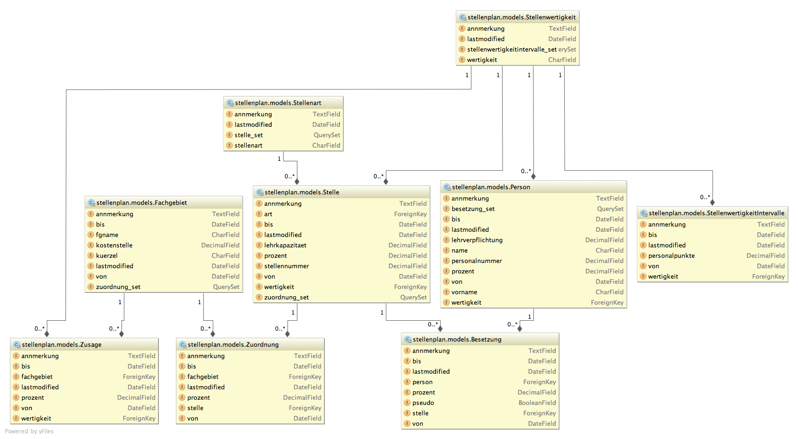

.. Stellenplan documentation master file, created by
   sphinx-quickstart on Fri Oct  4 15:04:51 2013.
   You can adapt this file completely to your liking, but it should at least
   contain the root `toctree` directive.

Welcome to Stellenplan's documentation!
=======================================

Contents:

.. toctree::
   :maxdepth: 2

Dokumentation für Nutzer
=========================

..include:: grundkonzepte.rst

Technische Dokumentation
========================

Models
------

.. automodule:: stellenplan.models
    :members:

Indices and tables
==================

* :ref:`genindex`
* :ref:`modindex`
* :ref:`search`

